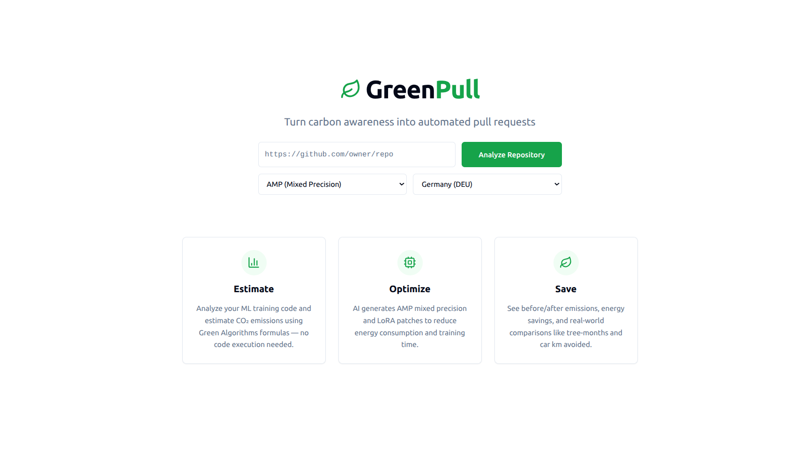
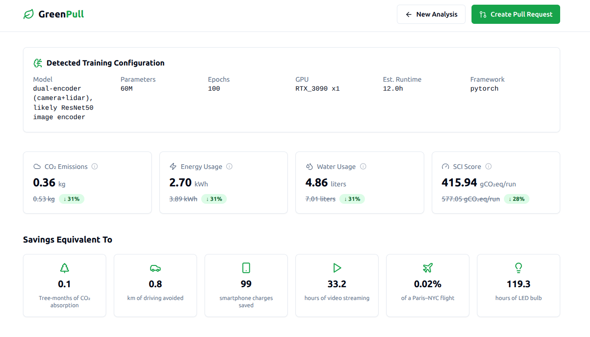

<p align="center">
  
</p>

<p align="center">
  <strong>Turn carbon awareness into automated pull requests.</strong>
</p>

<p align="center">
  <a href="#features">Features</a> &bull;
  <a href="#how-it-works">How It Works</a> &bull;
  <a href="#quick-start">Quick Start</a> &bull;
  <a href="#docker">Docker</a> &bull;
  <a href="#api-reference">API Reference</a> &bull;
  <a href="#estimation-methodology">Methodology</a> &bull;
  <a href="#tech-stack">Tech Stack</a>
</p>

---

GreenPull is a carbon-aware optimization platform for machine learning training code. Point it at any GitHub repository containing ML training scripts, and it will estimate the carbon footprint, generate energy-saving patches across multiple files, and open a pull request — all without executing a single line of your code.

<p align="center">
  
</p>

## Features

- **Whole-repo analysis** — Scans the entire repository to identify training entrypoints, model definitions, data loaders, and config files. Applies targeted optimizations per file role.
- **Multi-file optimization patches** — Generates AMP (mixed precision), LoRA (parameter-efficient fine-tuning), DataLoader optimizations, and config-level improvements across all relevant files.
- **Carbon emissions estimation** — Computes baseline and optimized CO₂ emissions using [Green Algorithms](https://www.green-algorithms.org/) formulas with hardware-specific TDP data for 25+ GPU models.
- **Real-time carbon intensity** — Integrates with the [Electricity Maps API](https://www.electricitymaps.com/) for live grid carbon intensity, green scheduling windows, and lowest-carbon cloud region recommendations.
- **Water usage tracking** — Estimates datacenter cooling water consumption using industry WUE (Water Usage Effectiveness) factors.
- **SCI scoring** — Computes the [Software Carbon Intensity](https://sci.greensoftware.foundation/) metric per the Green Software Foundation standard: `SCI = ((E × I) + M) / R`.
- **Interactive KaTeX formulas** — Every metric card includes hover tooltips with rendered LaTeX formulas explaining the underlying calculation.
- **One-click PR creation** — Opens a GitHub pull request with all optimized files on a dedicated branch, complete with a detailed description of changes and estimated savings.
- **Real-world comparisons** — Translates savings into intuitive equivalents: tree-months of CO₂ absorption, km of driving avoided, smartphone charges, streaming hours, and more.

<p align="center">
  
</p>

## How It Works

```
┌─────────────────────────────────────────────────────────────────┐
│                        GreenPull Pipeline                       │
├─────────────────────────────────────────────────────────────────┤
│                                                                 │
│  1. Clone repo                                                  │
│     └─► Git clone to temp directory                             │
│                                                                 │
│  2. Detect & classify files                                     │
│     └─► Regex scoring + Gemini analysis                         │
│     └─► Identify entrypoint, model, dataloader, config files    │
│                                                                 │
│  3. Extract training configuration                              │
│     └─► Gemini reads source, configs, imports, README           │
│     └─► Outputs: model type, params, epochs, GPU, runtime       │
│                                                                 │
│  4. Estimate baseline emissions                                 │
│     └─► Green Algorithms: Power × Runtime × Carbon Intensity    │
│     └─► Live carbon intensity from Electricity Maps API         │
│                                                                 │
│  5. Generate optimization patches (multi-file)                  │
│     └─► Phase 1: Gemini plans coordinated changes               │
│     └─► Phase 2: Per-file patching (AMP / LoRA / DataLoader)   │
│                                                                 │
│  6. Estimate optimized emissions                                │
│     └─► Re-run estimation with adjusted runtime & memory        │
│                                                                 │
│  7. Report results                                              │
│     └─► Savings, comparisons, SCI, water, region, scheduling    │
│     └─► Optional: Open GitHub PR with all patches               │
│                                                                 │
└─────────────────────────────────────────────────────────────────┘
```

> **No code execution.** All estimation is performed via static analysis and Green Algorithms formulas.

## Quick Start

### Prerequisites

- Python 3.10+
- Node.js 18+
- Redis server
- A [Google Gemini API key](https://aistudio.google.com/apikey)
- (Optional) [Electricity Maps API token](https://www.electricitymaps.com/free-tier-api) for live carbon data

### 1. Clone the repository

```bash
git clone https://github.com/your-org/GreenPull.git
cd GreenPull
```

### 2. Backend setup

```bash
cd backend
python -m venv .venv && source .venv/bin/activate
pip install -r requirements.txt
```

Create a `.env` file in the `backend/` directory:

```env
GEMINI_API_KEY=your-gemini-api-key
GEMINI_MODEL=gemini-2.5-flash

# Optional: for live carbon intensity data
ELECTRICITYMAPS_API_TOKEN=your-token

# Optional: for PR creation
GITHUB_TOKEN=ghp_your-token
```

Start the backend (Redis + worker + API):

```bash
bash run.sh
```

The API server starts at `http://localhost:8000`.

### 3. Frontend setup

```bash
cd frontend
npm install
npm run dev
```

The dev server starts at `http://localhost:8080` and proxies API requests to the backend.

### 4. Open the app

Navigate to [http://localhost:8080](http://localhost:8080), paste a GitHub repo URL, select an optimization strategy, and hit **Analyze Repository**.

## Docker

The fastest way to run the full stack:

```bash
docker compose up --build
```

This starts all four services:

| Service    | Port  | Description                     |
|------------|-------|---------------------------------|
| `frontend` | 3000  | React app (nginx)               |
| `backend`  | 8000  | FastAPI server                  |
| `worker`   | —     | RQ background job worker        |
| `redis`    | 6379  | Message queue & job broker      |

Create a `.env` file in the project root before running:

```env
GEMINI_API_KEY=your-gemini-api-key
ELECTRICITYMAPS_API_TOKEN=your-token    # optional
GITHUB_TOKEN=ghp_your-token             # optional
```

To rebuild after code changes:

```bash
docker compose up --build
```

## API Reference

### Endpoints

| Method | Path                        | Description                          |
|--------|-----------------------------|--------------------------------------|
| POST   | `/api/analyze`              | Submit a repository for analysis     |
| GET    | `/api/jobs/{job_id}`        | Get job status and results           |
| GET    | `/api/jobs`                 | List recent jobs                     |
| POST   | `/api/jobs/{job_id}/create-pr` | Create a GitHub PR from results   |
| GET    | `/api/health`               | Health check                         |

### POST /api/analyze

```json
{
  "repo_url": "https://github.com/user/ml-training-repo",
  "patch_type": "both",
  "country_iso_code": "DEU"
}
```

| Parameter          | Type   | Default | Description                                           |
|--------------------|--------|---------|-------------------------------------------------------|
| `repo_url`         | string | —       | GitHub repository URL                                 |
| `patch_type`       | string | `"amp"` | `"amp"`, `"lora"`, or `"both"`                        |
| `country_iso_code` | string | `"DEU"` | ISO 3166-1 alpha-3 code for carbon intensity region   |

### Job Status Progression

```
queued → cloning → analyzing → extracting_config → estimating_baseline → patching → estimating_optimized → completed
```

### Response Fields

| Field                    | Description                                                       |
|--------------------------|-------------------------------------------------------------------|
| `detection`              | Entrypoint file, framework, run command                           |
| `training_config`        | Model type, parameters, epochs, batch size, GPU, est. runtime     |
| `baseline` / `optimized` | Emissions (kg CO₂), energy (kWh), duration, CPU/GPU breakdown    |
| `savings`                | Absolute and percentage reductions in emissions and energy        |
| `comparisons`            | Tree-months, car km, smartphone charges, streaming hours, etc.    |
| `patch_diff`             | Combined unified diff across all modified files                   |
| `patched_files`          | List of modified files with roles and optimization types          |
| `carbon_intensity_info`  | Live grid carbon intensity for the selected region                |
| `green_window`           | Optimal 72h scheduling window for lowest-carbon training          |
| `region_recommendation`  | Lowest-carbon cloud region suggestion                             |
| `water_usage`            | Estimated water consumption (baseline vs optimized)               |

## Estimation Methodology

Based on the [Green Algorithms](https://www.green-algorithms.org/) framework (Lannelongue et al., 2021):

```
Power (W)  = PUE × (CPU_cores × TDP_per_core × usage + n_GPUs × GPU_TDP × usage + memory_GB × 0.375)
Energy (kWh) = Power × runtime_hours / 1000
Carbon (gCO₂) = Energy × carbon_intensity(region)
```

**Hardware coverage:**
- GPU TDP data for 25+ models (H100, A100, A6000, V100, T4, RTX 3090/4090, and more)
- CPU TDP for 10 classes (Xeon, EPYC, Ryzen, Apple Silicon, cloud instances)
- Carbon intensity for 40+ countries sourced from Electricity Maps and IEA data

**Additional metrics:**
- **SCI** (Green Software Foundation): `SCI = ((E × I) + M) / R` with embodied emissions estimated at ~4.28 gCO₂/h/GPU
- **Water usage**: `Water = Energy × WUE` with industry-average WUE of 1.8 L/kWh
- **Green window**: 72-hour grid intensity forecast for optimal scheduling
- **Region recommendation**: Cross-region carbon intensity comparison for cloud provider selection

## Tech Stack

| Layer       | Technology                                                                 |
|-------------|----------------------------------------------------------------------------|
| Frontend    | React 18, TypeScript, Vite, Tailwind CSS, shadcn/ui, Recharts, KaTeX      |
| Backend API | FastAPI, SQLite, SQLAlchemy, Pydantic                                      |
| Job Queue   | Redis, RQ (Redis Queue)                                                    |
| AI          | Google Gemini 2.5 Flash (detection, config extraction, patching)           |
| Estimation  | Green Algorithms formulas, CodeCarbon hardware data                        |
| Carbon Data | Electricity Maps API (live intensity, forecasts, region recommendations)   |
| Git         | PyGithub (PR creation), GitPython (repo cloning)                           |

## License

MIT

---

<p align="center">
  Built for <strong>HackEurope 2026</strong>
</p>
